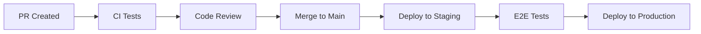

# Operations Guide

## Deployment Strategy

### Environments
- **Development**: local development
- **Staging**: pre-production testing  
- **Production**: live application

### Deployment Pipeline


### Release Schedule
- **Hotfixes**: immediate pentru critical bugs
- **Minor releases**: weekly (Fridays)
- **Major releases**: bi-weekly cu feature freeze

## Monitoring & Alerting

### Application Monitoring
- **Uptime**: 99.9% SLA target
- **Response times**: p95 <200ms
- **Error rates**: <1% pentru normal traffic
- **Core Web Vitals**: LCP <2s, CLS <0.1

### Infrastructure Monitoring
```yaml
alerts:
  high_error_rate:
    condition: error_rate > 5%
    duration: 5m
    severity: critical
    
  slow_response_time:
    condition: p95_response_time > 500ms  
    duration: 2m
    severity: warning
    
  database_connections:
    condition: active_connections > 80%
    duration: 1m
    severity: warning
```

### Database Monitoring
- **Connection pool**: utilization <80%
- **Query performance**: p95 <200ms
- **Lock contention**: minimal blocking
- **Backup status**: daily verification

## Incident Response

### Severity Levels
1. **Critical**: System down, data loss, security breach
2. **High**: Major feature broken, significant performance impact  
3. **Medium**: Minor feature issues, moderate performance impact
4. **Low**: Cosmetic issues, minor bugs

### Response Times (SLA)
- **Critical**: 15 minutes acknowledgment, 2 hours resolution
- **High**: 1 hour acknowledgment, 8 hours resolution
- **Medium**: 4 hours acknowledgment, 24 hours resolution  
- **Low**: 24 hours acknowledgment, 1 week resolution

### On-Call Rotation
```yaml
primary_oncall: @core-platform
secondary_oncall: @core-frontend  
escalation: @security (pentru security incidents)
```

## Backup & Recovery

### Database Backups
- **Frequency**: Daily automated backups
- **Retention**: 30 days pentru daily, 12 months pentru weekly
- **Testing**: Monthly restore tests
- **RTO**: 4 hours pentru production restore

### Application Data
- **Configuration**: Version controlled în Git
- **Secrets**: Encrypted în secret management system
- **User uploads**: Replicated across multiple regions

### Disaster Recovery
```yaml
recovery_scenarios:
  database_failure:
    rto: 4 hours
    rpo: 1 hour
    
  region_outage:
    rto: 8 hours  
    rpo: 1 hour
    
  complete_failure:
    rto: 24 hours
    rpo: 4 hours
```

## Security Operations

### Security Monitoring
- **Failed login attempts**: >5 în 15 min trigger alert
- **Unusual access patterns**: geographic sau temporal
- **Privilege escalation**: automatic detection
- **Data access anomalies**: ML-based detection

### Security Patching
- **Critical patches**: within 24 hours
- **High severity**: within 1 week  
- **Medium severity**: within 1 month
- **Low severity**: next scheduled maintenance

### Access Management
- **Admin access**: MFA required, logged și monitored
- **Database access**: VPN + bastion host only
- **Production access**: minimal, temporary, audited

## Performance Operations

### Capacity Planning
- **Traffic growth**: plan pentru 2x growth over 6 months
- **Database scaling**: horizontal sharding strategy
- **CDN utilization**: global edge distribution
- **Caching layers**: multi-tier caching strategy

### Performance Optimization
```typescript
// Performance monitoring setup
const performanceConfig = {
  coreWebVitals: {
    lcp: { target: 2000, alert: 2500 },
    cls: { target: 0.1, alert: 0.15 },
    fid: { target: 100, alert: 150 }
  },
  apiResponse: {
    p50: { target: 100, alert: 150 },
    p95: { target: 200, alert: 300 },
    p99: { target: 500, alert: 750 }
  }
};
```

## Maintenance Windows

### Scheduled Maintenance
- **Frequency**: Monthly, first Sunday, 2-6 AM UTC
- **Duration**: Maximum 4 hours
- **Notification**: 48 hours advance notice
- **Rollback plan**: Always prepared

### Emergency Maintenance
- **Approval**: CTO approval required
- **Communication**: Real-time status updates
- **Post-mortem**: Required pentru all emergency maintenance
