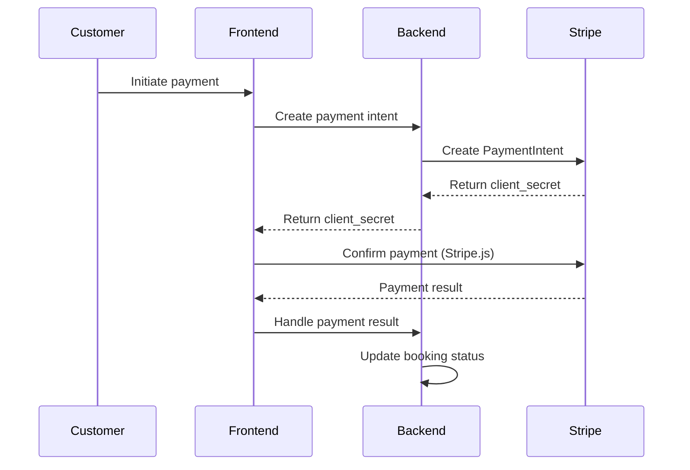

# Stripe Integration Guide

## Overview

Integration cu Stripe pentru processing plăți în Vantage Lane Admin.

## Payment Flow



## Stripe Configuration

### Webhooks
```typescript
const webhookEvents = [
  'payment_intent.succeeded',
  'payment_intent.payment_failed', 
  'charge.dispute.created',
  'invoice.payment_succeeded',
  'customer.subscription.updated'
];
```

### Products & Pricing
```typescript
interface RideProduct {
  id: string; // Stripe product ID
  name: 'Standard Ride' | 'Premium Ride' | 'Luxury Ride';
  pricing: 'per_km' | 'fixed_rate' | 'time_based';
}
```

## Payment Methods

### Supported Types
- **Cards**: Visa, Mastercard, American Express
- **Digital Wallets**: Apple Pay, Google Pay
- **Bank Transfers**: SEPA (EU), ACH (US)
- **Buy Now Pay Later**: Klarna, Afterpay

### Implementation
```typescript
// Create payment intent
const createPaymentIntent = async (bookingId: string, amount: number) => {
  const paymentIntent = await stripe.paymentIntents.create({
    amount: amount * 100, // Convert to cents
    currency: 'eur',
    metadata: {
      booking_id: bookingId,
      customer_id: customerId
    },
    automatic_payment_methods: {
      enabled: true,
    },
  });
  
  return paymentIntent.client_secret;
};
```

## Refunds & Disputes

### Refund Policy
- **Full refund**: cancelled >24h before ride
- **Partial refund**: cancelled 2-24h before ride  
- **No refund**: cancelled <2h before ride
- **Emergency refund**: driver no-show, safety issues

### Dispute Management
```typescript
interface DisputeHandling {
  auto_response: boolean; // For low-value disputes
  evidence_collection: {
    trip_data: boolean;
    communication_logs: boolean;
    gps_tracking: boolean;
  };
  escalation_threshold: number; // Amount in EUR
}
```

## Payouts to Drivers

### Payout Schedule
- **Frequency**: Daily pentru active drivers
- **Minimum**: 10 EUR minimum payout
- **Processing time**: 2-3 business days
- **Fees**: Stripe payout fees apply

### Commission Structure
```typescript
const commissionRates = {
  standard: 0.15,    // 15% commission
  premium: 0.12,     // 12% for premium drivers
  corporate: 0.10    // 10% for corporate contracts
};
```

## Financial Reporting

### Required Reports
- **Daily settlements**: total GMV, fees, net revenue
- **Monthly statements**: per-driver earnings
- **Tax reporting**: 1099/VAT compliance
- **Chargeback reports**: dispute tracking

### Data Export
```typescript
interface FinancialExport {
  period: 'daily' | 'weekly' | 'monthly';
  format: 'csv' | 'pdf' | 'json';
  recipients: string[]; // Email addresses
  automatic: boolean;
}
```

## Compliance & Security

### PCI Compliance
- **Level**: Merchant Level 4 (SAQ-A)
- **Card data**: Never stored on our servers
- **Tokenization**: Stripe tokens only
- **HTTPS**: All payment pages

### Regulatory Compliance
- **PSD2**: Strong Customer Authentication (EU)
- **GDPR**: Data protection și right to deletion
- **Tax compliance**: VAT collection per jurisdiction

## Testing Strategy

### Test Cards
```typescript
const testCards = {
  successful: '4242424242424242',
  declined: '4000000000000002', 
  insufficient_funds: '4000000000009995',
  disputed: '4000000000000259'
};
```

### Webhook Testing
```bash
# Test webhook endpoints
stripe listen --forward-to localhost:3000/api/webhooks/stripe
```

## Error Handling

### Common Errors
```typescript
const errorHandling = {
  card_declined: 'Please try a different payment method',
  insufficient_funds: 'Insufficient funds on your card',
  expired_card: 'Your card has expired', 
  processing_error: 'Payment processing failed, please try again'
};
```

### Monitoring & Alerts
- **Failed payments**: >5% rate triggers alert
- **Webhook failures**: immediate notification
- **Chargeback rate**: >1% triggers review
- **Payout failures**: driver notification + support ticket
